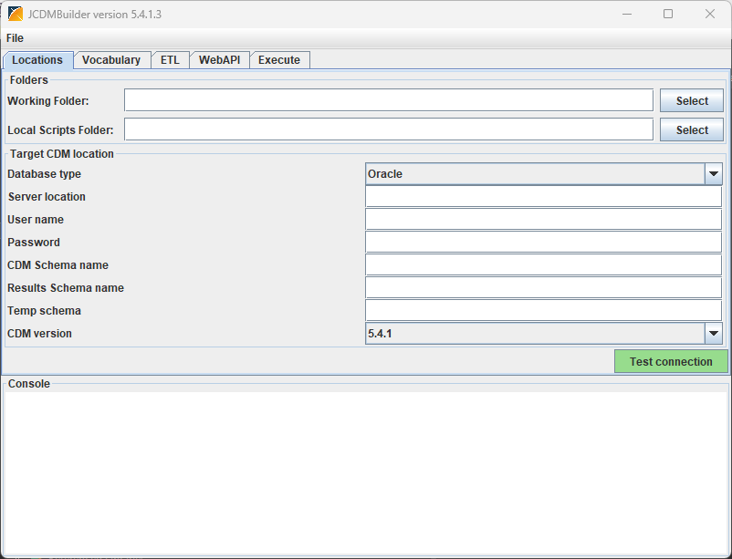
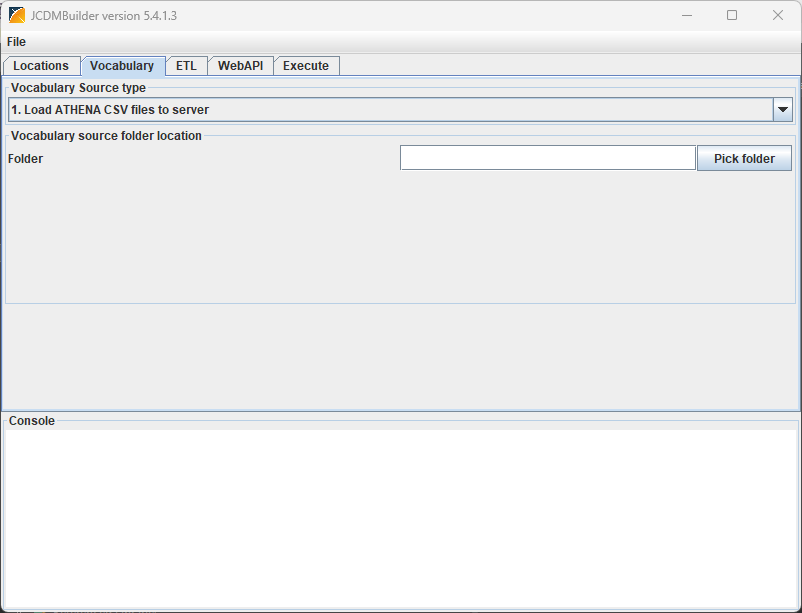
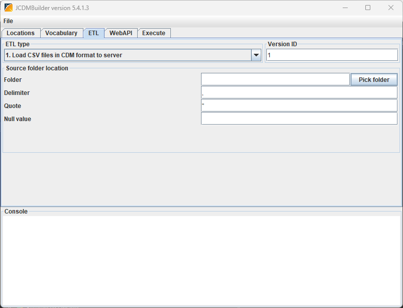
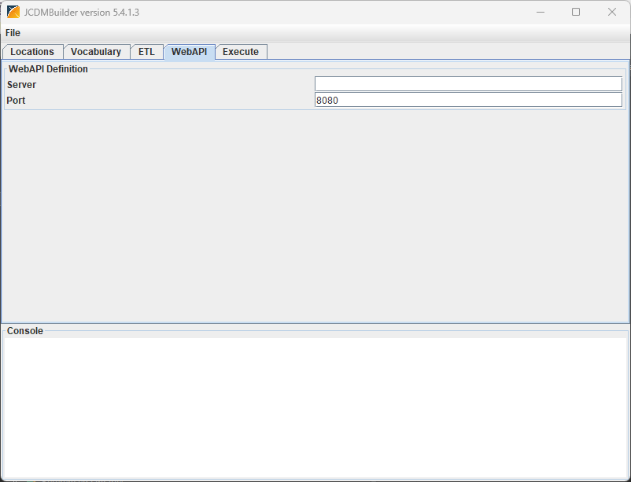
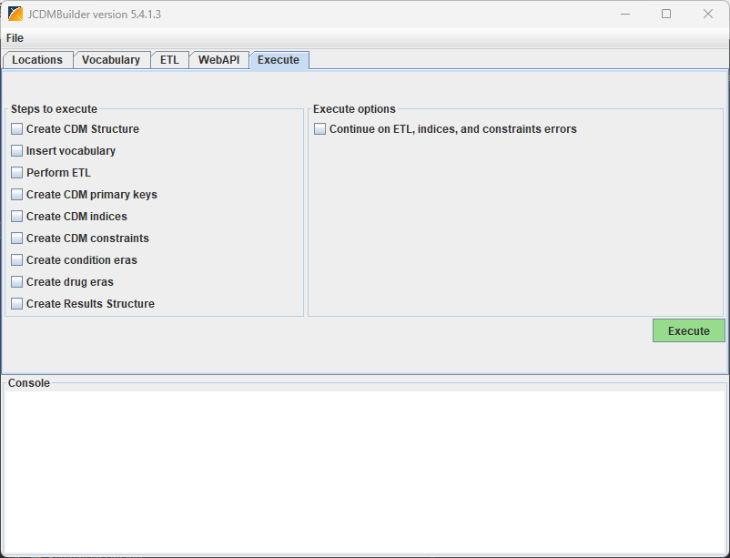

JCdmBuilder
==============

The JCdmBuilder is a Java program that offers various tools that can be used for loading data in the OMOP Common Data Model (CDM).  

Features
========
* You can load data in CDM format from CSV files into the database.
* Creating the database structure and indices for CDM version 5.0.1, 5.3.0, 5.3.1, 5.4.0, 5.4.1, prepared for version 6.0.
* Loading the vocabulary from files into the database.
* Automatically creating condition and drug eras.
* Supports SQL Server, Oracle and PostgreSQL.
* Supports bulk load from CSV files for PostgreSQL and SQL Server.
* Command line interface for automated execution.

Screenshots
===========

_The Locations tab._
  

_The Vocabulary tab._
  

_The ETL tab._
  

_The WebAPI tab._
  

_The Execute tab._
  

Technology
============
JCdmBuilder is a Java program.

System Requirements
============
* Java

Dependencies
============
None
 
Getting Started
===============

1. Under the [Releases](https://github.com/OHDSI/JCdmBuilder/releases) tab, download the latest JCDMBuilder jar file.
2. Double-click on the jar file to start the application.

The first three numbers in the version number correspond to the last accepted release of the CDM that is implemented in the JCDMBuilder.  
There is also a command-line-interface. Type `java -jar JCDMBuilder_v?.?.?.?.jar -usage` for more information or see the 
the section on the command line interface below.

Interface
=========

The interface consists of a menu and four tabs.

_The File menu_

The File menu contains three options:

| **Option** | **Description** |
| ------------------------ | ----------------------------------------------------------------------------- |
| Load settings | Load the settings from a settings file saved earlier. |
| Save settings | Save the settings (with exception of the password) to a settings file. |
| Exit | Exit the JCDMBuilder. |

_The Locations tab_

The Locations tab contains the location of the working folder and all information for connecting to the target database.

| **Field** | **Description** |
| ------------------------ | ----------------------------------------------------------------------------- |
|Working folder | This is the folder where the log file (Console.txt) and the error files are written. |

The section "Target CDM Location" contains all information on how to connect to the target database. Currently the JCDMBuilder supports three database types for which we will describe how to fill the connection details.

Oracle:

| **Field** | **Description** |
| ------------------------ | ----------------------------------------------------------------------------- |
| Server location | \<server name/IP-address\>[\:\<port\>]/\<SID\> |
| User name | The user used to connect to the database. This user should have the right to create and remove a schema/user. |
| Password | The password of the user. This password will also be used for the CDM and Results schama's/users. |
| CDM Schema name | The name of the schema/user that will hold the CDM tables. |
| Results Schema name | The name of the schema/user that will hold the Results tables of Achilles/Atlas. |
| Temp Schema name | The name of the schema that will hold temporary tables of Achilles/Atlas. |
| CDM version | The version of the OMOP CDM to be used. |

PostgreSQL:

| **Field** | **Description** |
| ------------------------ | ----------------------------------------------------------------------------- |
| Server location | \<server name/IP-address\>[\:\<port\>]/\<database name\> |
| User name | The user used to connect to the database. This user should have the right to create and remove a schema. |
| Password | The password of the user. |
| CDM Schema name | The name of the schema that will hold the CDM tables. |
| Results Schema name | The name of the schema that will hold the Results tables of Achilles/Atlas. |
| Temp Schema name | The name of the schema that will hold temporary tables of Achilles/Atlas. |
| CDM version | The version of the OMOP CDM to be used. |

SQL Server:

| **Field** | **Description** |
| ------------------------ | ----------------------------------------------------------------------------- |
| Server location | \<server name/IP-address\>[\:\<port\>];database=\<database name\>; |
| User name | The user used to connect to the database. |
| Password | The password of the user. |
| CDM Schema name | The name of the schema that will hold the CDM tables. |
| Results Schema name | The name of the schema that will hold the Results tables of Achilles/Atlas. |
| Temp Schema name | The name of the schema that will hold temporary tables of Achilles/Atlas. |
| CDM version | The version of the OMOP CDM to be used. |

_The Vocabulary tab_

The Vocabulary tab contains all information on the location of the vocabulary files/schema and how to load it.
At the top of this tab is a drop down list containing three options. For each of the options different fields are shown.
The options and their corresponding fields are: 

1. Load ATHENA CSV files to server

With this option the records are inserted directly into the database.

| **Field** | **Description** |
| ------------------------ | ----------------------------------------------------------------------------- |
| Folder | The folder where the CSV files of the vocabulary are stored. |

2. Bulk Load ATHENA CSV files from server to server

With this option the files are first copied to a folder on the database server and then loaded into the database in bulk mode.
This option is not available for Oracle.

| **Field** | **Description** |
| ------------------------ | ----------------------------------------------------------------------------- |
| Folder | The folder where the CSV files of the vocabulary are stored. |
| Server folder | The folder that is mapped to a folder on the database server where the files can be copied to for the import. |
| Local path server folder | The path on the database server where the files are copied to. |

3. Load vocabulary from schema

With this option the vocabulary is copied from another schema in the database.
This option is not available for Oracle.

| **Field** | **Description** |
| ------------------------ | ----------------------------------------------------------------------------- |
| Schema | The schema where the source vocabulary is stored. The user specified in the Locations tab should also have access to this schema. |

_The ETL tab_

The ETL tab contains information on the location of the data files and the format and how to load them.
At the top of this tab is a drop down list containing two options. For each of the options different fields are shown.
Next to the drop down list is a field where you can specify a version number.
The options and their corresponding fields are:

1. Load CSV files in CDM format to server

With this option the records are inserted directly into the database.

| **Field** | **Description** |
| ------------------------ | ----------------------------------------------------------------------------- |
| Folder | The folder where the CSV files of the data are stored. |
| Delimiter | The character that is used as a field delimiter. Enter the text tab for a tab. |
| Quote | The character that is used to quote strings that contain the delimiter. |
| Null value | The string that is used to represent the Null value. |

2. Bulk Load CSV files in CDM format to server

With this option the files are first copied to a folder on the database server and then loaded into the database in bulk mode.
This option is not available for Oracle.

| **Field** | **Description** |
| ------------------------ | ----------------------------------------------------------------------------- |
| Folder | The folder where the CSV files of the data are stored. |
| Delimiter | The character that is used as a field delimiter. Enter the text tab for a tab. |
| Quote | The character that is used to quote strings that contain the delimiter. |
| Null value | The string that is used to represent the Null value. |
| Server folder | The folder that is mapped to a folder on the database server where the files can be copied to for the import. |
| Local path server folder | The path on the database server where the files are copied to. |

_The WebAPI tab_

The WebAPI tab contains information about the server where the WebAPI is installed. When you don't have a WebAPI installed enter a non existing server name.

| **Field** | **Description** |
| ------------------------ | ----------------------------------------------------------------------------- |
| Server | The name of the server where the WebAPI is installed. |
| Port | The port used by the WebAPI. |

_The Execute tab_

On the Execute tab you can specify what you want to do.
The box "Steps to execute" on this tab contains check boxes for all the steps to perform which lets you choose which steps to perform.
Be aware that the order in which they are listed is also the order in which they should be performed.
The "execute options" box contains a checkbox where you can specify if the JCDMBuilder should continue after an error has occurred during the ETL, indices and constraints.
With the Execute button you start the process.

Command Line Interface
======================

From the command line you can start the JCDMBuilder with the following command:

java -jar JCDMBuilder-vx.x.x.x [options]

The available options are:

| **Option** | **Description** |
| ------------------------ | ----------------------------------------------------------------------------- |
| -usage | Show the available options. |
| -help | Show the available options. |
| ? | Show the available options. |
| -settingsfile \<file\> | Use the specified settings file. |
| -targetpassword \<password\> | Set target database password. The password is not in the settingsfile. |
| -patchScriptsPath \<path\> | Set the path for SQL patch scripts. If not specified it looks for them in the 'SQL Scripts' folder next to the builder .jar file. |
| -idtobigint | When creating the CDM structure, use BIGINT instead of INT for all IDs. |

The following options allow the steps to be automatically executed. Steps are executed in order: 

| **Option** | **Description** |
| ------------------------ | ----------------------------------------------------------------------------- |
| -executecdmstructure                | Create default CDM structure on startup. |
| -executevocab                       | Insert vocabulary on startup. |
| -executeetl                         | Execute ETL on startup. |
| -executeprimarykeys                 | Create required primary keys on startup. |
| -executeindices                     | Create required indices on startup. |
| -executeconstraints                 | Add constraints on startup. |
| -executeconditioneras               | Create condition eras on startup. |
| -executedrugeras                    | Create drug eras on startup. |
| -executeresultsstructure            | Create results structure on startup. |
| -continueonerror                    | Continue after error during ETL, creating indices, and creating constraints. |

Getting Involved
=============
* Developer questions/comments/feedback: <a href="http://forums.ohdsi.org/c/developers">OHDSI Forum</a>
* We use the <a href="../../issues">GitHub issue tracker</a> for all bugs/issues/enhancements

License
=======
JCdmBuilder is licensed under Apache License 2.0

Acknowledgements
================
Janssen Pharmaceutical Research & Development, LLC
